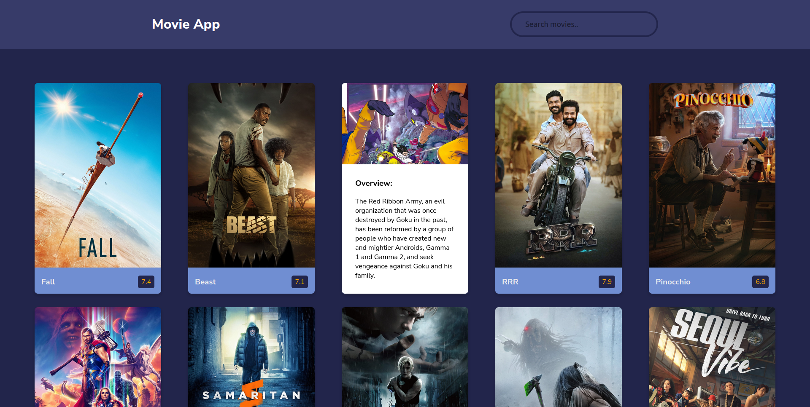

# Project Name 
    Movie App

 

## About The Project

    This is a movie app which makes it easier for movie fans to find some of their favourite movies available. It also shows some of the latest movies available. Just search any movie you want & tada 📂 there it is. You gonna love it 😊

## Authors Name

    Andrew Ochieng

## Table of contents

- [General info](#general-info)
- [Technologies](#technologies)
- [Setup](#setup)
- [Contact Me](#contact)

## General info

This is a movie app which makes it easier for movie fans to find some of their favourite movies available. It also shows some of the latest movies available. Just search any movie you want & tada 📂 there it is. You gonna love it 😊

## A view of the final product
 

 

## Technologies

    Project is created with:

        - HTML - Is used to build the structure of the pages.
        - CSS - Is used to style the pages
        - Google Fonts and Icons - Is used to impliment the icons and the fonts on the page
        - JavaScript - Functionality of the website includes e.g. DOM events, api data fetch & search.

## Requirements

- Either a computer, Ipad, tablet or phone -An access to internet connection

## Program Setup

To run this project, clone or download it from git hub. Using Live server or your developers environment(Text Editor), start the server using Live server extention and automatically the website will work.

## Contact

    email: andrewomosh44@gmail.com

[LinkedIn](https://www.linkedin.com/in/andrew-ochieng-00b076180/) | 
[Twitter](https://twitter.com/drew_omosh) | 
[Github](https://github.com/Andrew-Ochieng)

## Live GitHub Pages Link

[Movie App](https://andrew-ochieng.github.io/movie-app/)

## License information

[MIT](LICENCE)

Copyright (c) 2022 Andrew Ochieng
